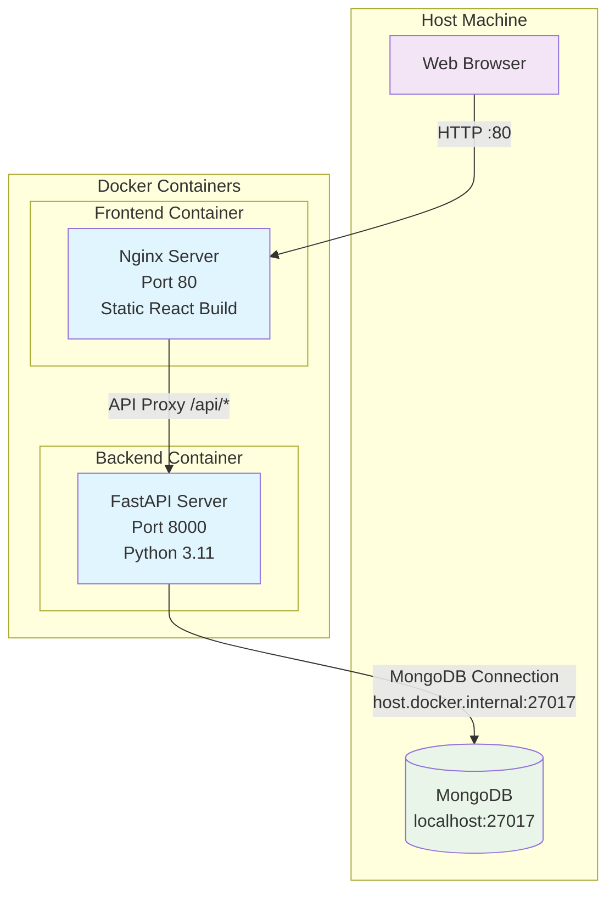
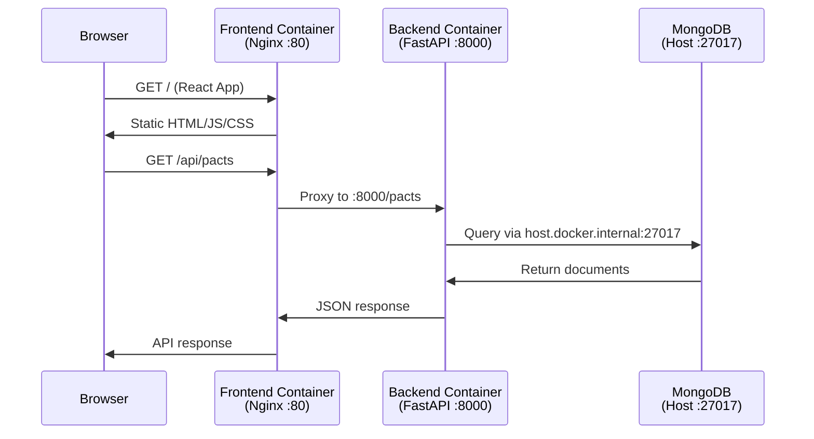

# PACT Docker Architecture

## System Overview

## Container Details

### Backend Container (pact-backend)
- **Base Image**: `python:3.11-slim`
- **Port**: 8000
- **Dependencies**: FastAPI, PyMongo, Uvicorn
- **MongoDB**: Connects to `host.docker.internal:27017`
- **Build**: `docker build -t pact-backend .`
- **Run**: `docker run -p 8000:8000 pact-backend`

### Frontend Container (pact-frontend)
- **Base Image**: `nginx:alpine` (multi-stage from `node:18-alpine`)
- **Port**: 80
- **Build Stage**: Vite React build
- **Serve Stage**: Nginx static file server
- **Build**: `cd client && docker build -t pact-frontend .`
- **Run**: `docker run -p 80:80 pact-frontend`

## Network Communication

## CORS Configuration

Backend allows requests from:
- `http://localhost:5173` (Vite dev server)
- `http://localhost:3000` (Alternative dev port)
- `http://localhost:80` (Docker frontend)
- `http://localhost` (Docker frontend, no port)

## Key Files

- `/Dockerfile` - Backend container definition
- `/client/Dockerfile` - Frontend container definition  
- `/client/nginx.conf` - Nginx configuration for frontend
- `/main.py` - FastAPI backend with `host.docker.internal` MongoDB connection